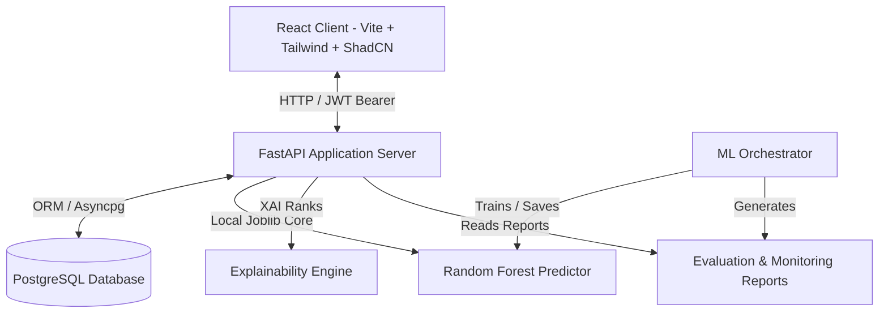

# 🏦 Loan-IQ: AI-Powered Loan Underwriting & Decision System

A production-ready, full-stack AI platform designed to automate and optimize the loan approval process. The system leverages a **Random Forest Classifier** with GridSearchCV hyperparameter tuning, features an explainable AI (XAI) mapping engine, and aggregates real-time asset distributions on a dashboard.

---

## 🏗️ System Architecture & Stack

The platform is designed in a three-tier decoupled architecture:



1. **Frontend**: React + Vite SPA styled with Tailwind CSS, Lucide icons, and Recharts analytics.
2. **Backend**: FastAPI with async route handlers, HTTP Bearer JWT authentication, and ML service layers.
3. **Database**: PostgreSQL (accessible via Supabase or local Docker) managed via SQLAlchemy (async) and Alembic migrations. If no PostgreSQL database is provided, the backend falls back automatically to a local SQLite database (`loan_iq.db`) using `aiosqlite`.
4. **Machine Learning**: Scikit-Learn Random Forest Classifier + GridSearchCV cross-validation, featuring automated overfitting/underfitting checks, feature dominance alarms, and feature ablation monitoring.

---

## 🌟 Key Features & Engineering Highlights

* **Explainable AI (XAI)**: Generates human-readable local explanation weights (feature contributions) for every single prediction, detailing exactly why the model chose to approve or reject a loan application.
* **Real-time Model Health Monitoring**: Incorporates diagnostics checking for overfitting, underfitting, feature dominance, and run-time feature ablation checks.
* **Robust Cryptographic Architecture**: Implements direct, high-performance `bcrypt` password hashing compatible with Python 3.12+ (replacing outdated `passlib` contexts).
* **Decoupled Architecture**: Desktop-first React interface connected to an asynchronous FastAPI backend via JWT Bearer authentication.

---

## 🗂️ Project Repository Layout

```
Loan-IQ/
├── backend/                    # FastAPI Application
│   ├── alembic/                # SQL Schema Migrations
│   ├── app/
│   │   ├── middleware/         # JWT Auth guards
│   │   ├── models/             # SQLAlchemy ORM schemas
│   │   ├── routers/            # /auth, /predict, /analytics, /model-metrics
│   │   ├── schemas/            # Pydantic validation schemas
│   │   ├── services/           # ML predict & Analytics wrappers
│   │   ├── utils/              # Cryptographic helper methods
│   │   └── main.py             # Server entry point
│   ├── Dockerfile
│   └── requirements.txt
│
├── frontend/                   # React Client SPA
│   ├── src/
│   │   ├── components/         # Reusable layouts and custom UI elements
│   │   ├── context/            # AuthContext provider
│   │   ├── pages/              # Landing, Login, Prediction, Analytics, Admin
│   │   └── App.jsx             # Router config
│   ├── Dockerfile
│   └── nginx.conf              # SPA route rewriting config
│
├── ml/                         # Machine Learning Pipeline
│   ├── models/                 # Serialized model joblib files (.pkl)
│   ├── reports/                # Evaluation & Monitoring JSON runs
│   ├── src/                    # Data cleaning, engineering, and XAI code
│   └── train.py                # Pipeline training orchestrator
│
├── docker-compose.yml          # Local container configuration
└── loan_approval_dataset.csv   # Raw training data
```

---

## 🚀 Getting Started (Local Development)

### 1. Pre-requisites
- **Python**: Version `3.12` or `3.13`
- **Node.js**: Version `24.x` or similar LTS
- **PostgreSQL**: (Optional fallback uses SQLite automatically if no database URL is provided)

---

### 2. Machine Learning Training
You can train and evaluate the model locally before running the server:

```bash
# Set up ML virtual environment
python -m venv .venv
.venv\Scripts\Activate.ps1   # Windows (PowerShell)
source .venv/bin/activate    # Mac/Linux

# Install requirements
pip install -r backend/requirements.txt

# Run the training orchestrator (Full grid search)
python ml/train.py

# Run in FAST mode (reduced hyperparameter grid)
python ml/train.py --fast
```
*Successful runs generate model artifacts in `ml/models/` and performance summaries in `ml/reports/`.*

---

### 3. Backend Setup
1. Move to the backend folder:
   ```bash
   cd backend
   ```
2. Create your `.env` configuration:
   ```bash
   cp .env.example .env
   ```
3. Run Alembic database migrations (if using PostgreSQL):
   ```bash
   alembic upgrade head
   ```
   *(Note: If utilizing the SQLite fallback, the database tables will initialize automatically on application startup).*
4. Start the FastAPI development server:
   ```bash
   python -m uvicorn app.main:app --reload
   ```
*The interactive API documentation is available at `http://127.0.0.1:8000/docs`.*

---

### 4. Frontend Setup
1. Open a new terminal in the frontend directory:
   ```bash
   cd frontend
   ```
2. Install Node dependencies:
   ```bash
   npm install
   ```
3. Launch the hot-reloading dev server:
   ```bash
   npm run dev
   ```
4. Build the minified production bundle:
   ```bash
   npm run build
   ```
*The web dashboard is hosted locally at `http://localhost:5173/`.*

---

## 🐳 Docker Compose Deployment
To compile, link, and spin up the complete database, FastAPI backend, and React web service locally:

```bash
docker-compose up --build
```
- **React Frontend**: `http://localhost/` (Port 80)
- **FastAPI API**: `http://localhost:8000/`
- **PostgreSQL Database**: `localhost:5432`

---

## 🔗 Key API Specifications

| Method | Endpoint | Description | Auth Required |
|:---|:---|:---|:---:|
| **POST** | `/api/auth/register` | Create user account | No |
| **POST** | `/api/auth/login` | Return signed JWT access token | No |
| **POST** | `/api/predict` | Underwrite loan application parameters | **Yes** |
| **GET** | `/api/applications` | Return current user's history | **Yes** |
| **GET** | `/api/applications/all` | Return all system applications (Admin) | **Yes (Admin)** |
| **GET** | `/api/analytics` | Return dashboard aggregated charts | **Yes** |
| **GET** | `/api/model-metrics` | Return active model accuracy metrics | **Yes (Admin)** |
| **GET** | `/api/model-metrics/health` | Return monitoring and fitting checks | **Yes (Admin)** |

---

## 👥 Authors
- **Govind** (Lead Developer & Machine Learning Engineer)
